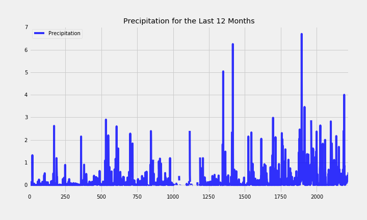
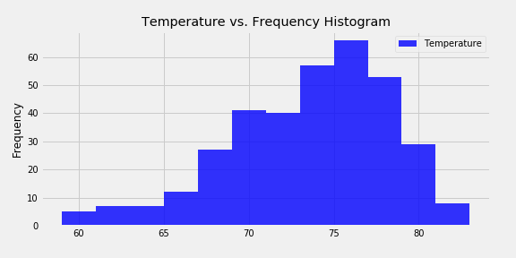
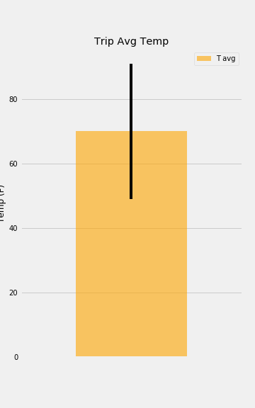
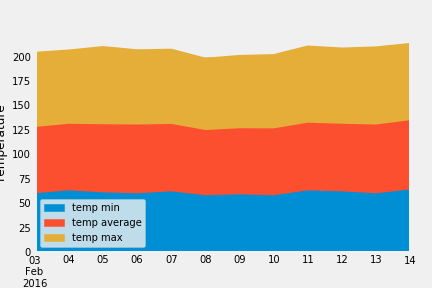

# SQL Alchemy Challenge

* The task of this challenge is to examine the available database for employee, from 1980s to 1990s. 
* The hawaii.sql database (located in Resource folder) is consisted of 2 CSV files (hawaii_measurements.csv and hawaii_stations.csv)
* The measurement.csv consists of id, station, date, prcp, tobs while stations.csv consists of id, station, name, latitutde, longitude, elevation. 

## Step 1 - Climate Analysis and Exploration

### *File Output: climate_starter.ipynb

### 1.1) Precipitation Analysis

*This graph shows precipitation level (in inches) for the last 12 months in Hawaii. 

### 1.2) Station Analysis

*First we find out which station has the highest number of observations. After that, we created a histogram to see the occureance of certain temperature level. 

## Step 2 -  Climate App
### *File Output: app.py

* We created several routes to retrieve the data from Step 1.

*/ 
*homepage index to see available routes 

*/api/v1.0/stations 
*query the precipitation value for date

*/api/v1.0/tobs 
*query dates and temperature observations of the most active station for the last year of data, in the form of JSON

*/api/v1.0/<start> and /api/v1.0/<start>/<end> 

*user can input a specific "start date" (in the format of yyyy/mm/dd) to find min, max, and average of temperature above the start date
*user can input "start date" and "end date" to find min, max, and average of temperature in between range of start and end date  

## Bonus: Other Recommended Analyses

### *File Output: climate_starter.ipynb

### Temperature Analysis 

*This bar graph shows the average temperature of starting date trip from the previous year. The peak-to-peak line shows the maximum and minimum temperature. 

### Daily Rainfall Average

*This area plot shows the min, max, and average temperature for the trip date. 

